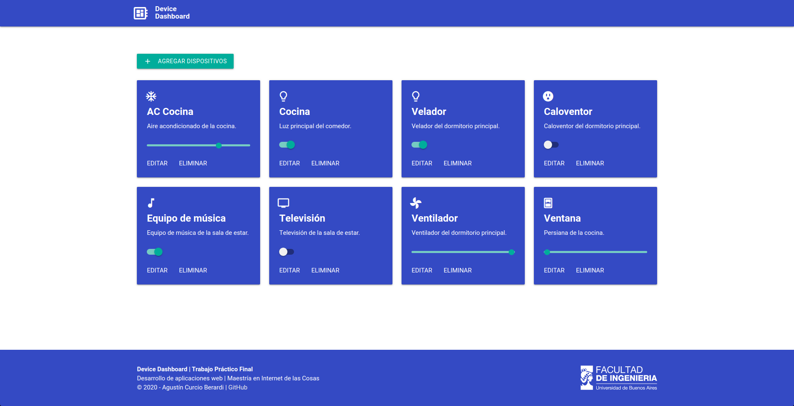
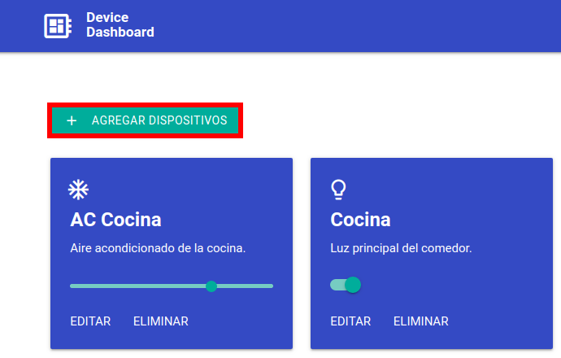
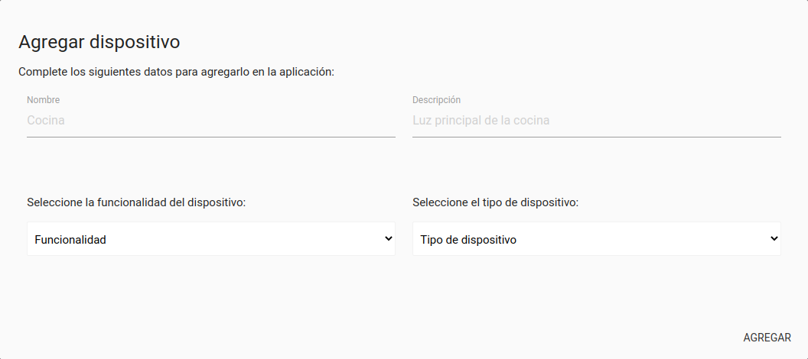
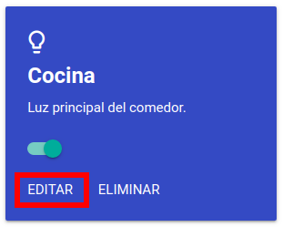
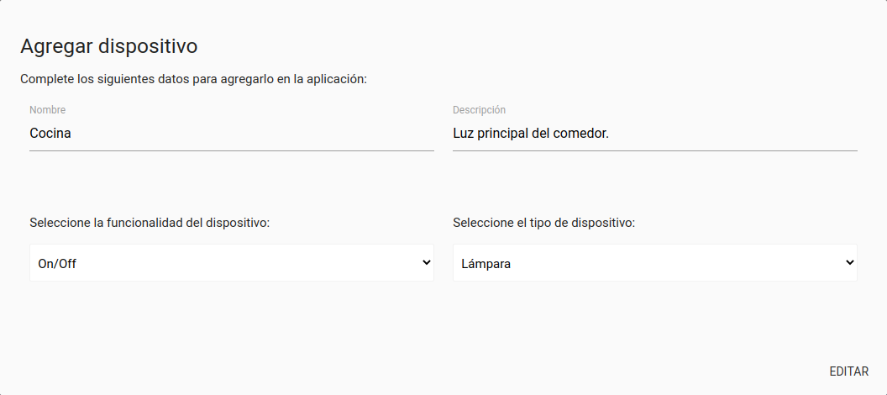
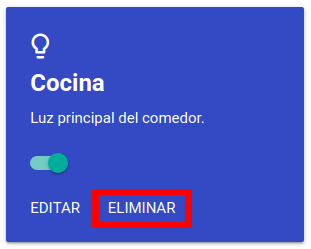
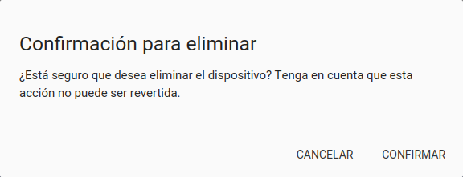
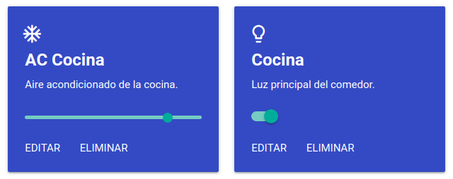

# Trabajo Práctico Final

Autor:

* Agustín Curcio Berardi

Docentes:

* Agustín Bassi
* Brian Ducca
* Santiago Germino

## Índice de contenidos

1. [Introducción general](#introducción)
2. [Instalación de dependencias](#instalación-de-dependencias)
3. [Implementación](#implementación)
4. [Ejecución de la aplicación](#ejecución-de-la-aplicación)
5. [Licencia](#licencia)

## Introducción general

El **Trabajo Práctico Final** de la materia **Desarrollo de Aplicaciones Web** consiste en el diseño de una "Single Page Application (SPA)" para poder controlar dispositivos inteligentes que pueden ser instalados en una casa. La propuesta consistió en aplicar los conceptos vistos en la materia para implementar nuevas funcionalidades a un ["template"](https://github.com/ce-iot/daw-project-template) utilizado en clase y que fue desarrollado por los docentes.

## Instalación de dependencias

La aplicación fue desarrollada sobre un contenedor Docker, motivo por el cual es necesario instalar algunas dependencias antes de poder ejecutarla. En las siguientes subsecciones se brindará más información la instalación de dichas herramientas, suponiendo que se está utilizando un sistema operativo Linux basado en la distribución Ubuntu.

### Docker

Docker es una herramienta que utiliza la tecnología de contenedores de Linux para crear imágenes. En dichas imágenes es posible contar con biliotecas, entornos de ejecución, código fuente, etc. para generar una abstracción del software y hardware en el cual la aplicación se ejecuta.
Para instalarla, se deberán ejecutar los siguientes comandos.

    $ sudo apt-get update 

    $ sudo apt-get install \
    apt-transport-https \
    ca-certificates \
    curl \
    gnupg-agent \
    software-properties-common

Instaladas las dependencias de Docker, se debe agregar la clave:

    $ curl -fsSL https://download.docker.com/linux/ubuntu/gpg | sudo apt-key add -

Y se necesita verificar la huella. Para ello, se debe comprobar los últimos ocho caracteres de la misma.

    $ sudo apt-key fingerprint 0EBFCD88

Finalizada la comprobación, se requiere agregar el repositorio oficial de Docker.

    $ sudo add-apt-repository \
    "deb [arch=amd64] https://download.docker.com/linux/ubuntu \
    $(lsb_release -cs) \
    stable"

E instalar Docker.

    sudo apt-get update
    sudo apt-get install docker-ce docker-ce-cli containerd.io

Una vez instalado, se necesita configurar los permisos de Docker para que un usuario pueda utilizarlo plenamente sin permisos de superusuario. Para ello, se ejecutan los siguientes comandos:

    sudo groupadd docker
    sudo usermod -aG docker $USER
    sudo gpasswd -a $USER docker

Por último, se requiere reiniciar Docker.

    sudo service docker restart

Y comprobar la instalación ejecutando un contenedor de prueba.

    sudo docker run hello-world

Si la instalación fue exitosa, deberá aparecer en la consola el siguiente mensaje:

    Unable to find image 'hello-world:latest' locally 
    latest: Pulling from library/hello-world 
    Hello from Docker! 
    ... 
    To try something more ambitious, you can run an Ubuntu container with: $ docker run -it ubuntu bash

### Docker Compose

Docker Compose es una herramienta de Docker que sirve para organizar de manera centralizada la gestión de varios contenedores de Docker que trabajan en conjunto dentro de una misma aplicación.

La instalación consiste principalmente en descargar un archivo binario y ejecutarlo. Para ello, se deberá correr el siguiente comando:

    sudo curl -L "https://github.com/docker/compose/releases/download/1.26.2/docker-compose-$(uname -s)-$(uname -m)" -o /usr/local/bin/docker-compose

Y darle al mismo permisos de ejecución

    sudo chmod +x /usr/local/bin/docker-compose

Para verificar que la instalación fue exitosa, ejecutar el siguiente comando, el cual debería arrojar la versión de Docker Compose.

    $ docker-compose --version
    docker-compose version 1.27.4, build 1110ad01

Por último, se debe reiniciar el equipo para que Docker inicialice con todas las configuraciones realizadas.

### Imágenes de Docker

Antes de poder ejecutar el contenedor del Trabajo Práctico Final, es necesario descargar las imágenes del repositorio oficial de Docker que son necesarias para ejecutar la aplicación. Para ello, se necesita ejecutar los siguientes comandos:

    docker pull harmish/typescript
    docker pull mysql:5.7
    docker pull phpmyadmin/phpmyadmin
    docker pull abassi/nodejs-server:10.0-dev

## Implementación

### Introducción específica

La aplicación **Device Dashboard** se ejecuta cuando un navegador se comunica con el servidor web mediante el envío de solicitudes HTTP. Dicho servidor utiliza la tecnología NodeJS para que, una vez establecida la conexión, se intercambien datos para que el navegador pueda presentar la aplicación web. La siguiente imagen muestra lo que vería el usuario al momento de ejecutarla.

Para desarrollar el **"frontend"** de la aplicación se utilizó el lenguaje de programación **TypeScript**, que es un superconjunto de JavaScript y que esencialmente añade tipos estáticos y objetos basados en clases. Así, para poder generar código en JavaScript basta con compilar el código fuente escrito en TypeScript. Por otro lado, en cuanto al desarrollo del **"backend"** se utilizó **Express.js**, que tal cual su nombre lo indica es un "framework" de Node.js que es gratuito y "open source". A su vez, se implementó una base de datos **MySQL** junto con el motor de bases de datos **phpMyAdmin**.

### Principio de funcionamiento

Cuando el cliente solicita el sitio web a través de una solicitud del tipo GET, el servidor proporciona el archivo ``index.html`` para mostrar el "cascarón" de la aplicación junto con una serie de archivos JavaScript. El principal de ellos es el ``Main.js``, el cual implementa la funcionalidad que se requeriere para cargar contenido de forma dinámica y sin tener que refrescar la página web (el refresco se hace cuando se detecta un cambio de forma automática). ``Main.js`` utiliza funciones implementadas en los archivos ``MyFramework.js`` y ``ViewMainPage.js``. En el primer archivo se programaron las funciones que se necesitan para cargar el contenido en la aplicación, es decir, cada una de las cajas o "cards" que muestran el ícono del dispositivo, su nombre, descripción, actuador y opciones disponibles. El segundo archivo contiene las funciones que se encargan de interactuar con el "backend" de la aplicación y así poder realizar consultas, editar datos o incluso eliminarlos.

> **NOTA**: La estructura de datos utilizada en esta aplicación difiere levemente respecto a la provista en el "template". Para soportar las nuevas funcionalidades, se requirió agregar información sobre las funciones que soporta el dispositivo (On/Off o dimerizable) el porcentaje en el cual se modificó un rango (para dispositivos dimerizables) y el tipo de dispositivo (para mostrar un ícono que lo represente en lugar de una imagen). Más información sobre la estructura de datos puede encontrarse en la sección [Base de datos](#base-de-datos).

### Organización del proyecto

El proyecto se encuentra conformado por la siguiente estructura de directorios y archivos:

    ├── db                          # Directorio de la base de datos (BD).
    │   ├── data                    # Estructura y datos de la BD.
    │   └── dumps                   # Directorio de estructuras de la BD.
    │       └── smart_home.sql      # Estructura con la BD "smart_home".
    ├── doc                         # Documentación general del proyecto.
    └── src                         # Directorio del código fuente.
    │   ├── back                    # Directorio para el backend de la aplicación
    │   │   ├── index.js            # Código principal del backend.
    │   │   ├── mysql-connector.js  # Código de conexion a la BD.
    │   │   ├── package.json        # Configuración de proyecto NodeJS.
    │   │   └── package-lock.json   # Configuración de proyecto NodeJS.
    │   └── front                   # Directorio para el frontend de la aplicacion
    │       ├── index.html          # Archivo principal del cliente HTML.
    │       ├── js                  # Código JavaScript compilado.
    │       ├── static              # Archivos estáticos (imágenes, CSS, fuentes).
    │       └── ts                  # Código TypeScript a compilar.
    ├── docker-compose.yml          # Archivo de configuracion del contenedor.
    ├── README.md                   # Archivo actual.
    ├── CHANGELOG.md                # Archivo para guardar cambios.
    ├── LICENSE.md                  # Archivo de licencia.

### Desarrollo del "frontend"

De acuerdo a las consignas del Trabajo Práctico Final, se implementaron las siguientes funcionalidades en el "frontend".

#### Adición de nuevos dispositivos

La consigna proponía adaptar el "frontend" para permitir la adición de nuevos dispositivos. Para ello, se dispuso un botón destinado para tal fin.

Al hacer click en el mismo, se despliega un "modal" que permite ingresar todos los datos necesarios para agregar un nuevo dispositivo en la aplicación.

#### Edición de dispositivos existenes

La propuesta consistía en habilitar la posibilidad para modificar parámetros de dispositivos existentes como ser nombre, descripción y tipo. Para ello, cada dispositivo cuenta con un botón para editarlo, tal cual se muestra en la siguiente imagen.

Al hacer click en dicho botón, se abre un "modal" que muestra los datos actuales del dispositivo para que el usuario pueda modificarlos. En la siguiente figura se muestra la "modal" en cuestión.

#### Eliminación de dispositivos

Se propuso agregar la funcionalidad necesaria para eliminar dispositivos de la aplicación. Para ello, de dispuso en cada uno de ellos un botón para eliminar, tal cual se muestra en la siguiente figura.

Cuando se hace click en dicho botón, se solicita confirmación al usuario a través de un "modal" para borrar el dispositivo y eliminarlo definitivamente de la base de datos.

Internamente, todas estas funcionalidades se soportan asociando el método  ``addEventListener()`` de todos esos elementos HTML al evento ``click`` y en base al ``id`` del elemento realizar el procesamiento adecuando dentro de la función ``handleEvent()``.

#### Soporte de rangos

La propuesta del Trabajo Práctico Final establecía la posibilidad de agregar un rango para los casos donde el estado del dispositivo no fuese binario. Por ejemplo, para el caso de una lámpara inteligente o una persiana, sería deseable poder indicar una intensidad. Para ello, se agregó un actuador del tipo "slider" además de los del tipo "switch" para estados binarios. Esto se puede apreciar en la siguiente imagen.

Para soportar esta funcionalidad, fue necesario agregar nuevos campos a la base de datos. En la subsección dedicada para tal fin se encuentra explicado con mayor detalle.

### Desarrollo del "backend"

Además del soporte estándar a solicitudes del tipo GET (ya incluídas en el "template"), las consignas del Trabajo Práctico Final proponían implementar las siguientes funcionalidades en el "backend".

#### Adición y edición de información

Tanto la adición como la edición de los nuevos datos se realiza mediante solicitudes el tipo POST. Para ello, se definió el siguiente direccionamiento:

    app.post('/devices/', function(req, res)

La comunicación entre el "frontend" y el "backend" se realiza mediante la transferencia de un archivo JSON. Por este motivo, dentro del direccionamiento es posible relevar la cantidad de "keys" que posee el JSON que se recibió y decidir el tipo de "query" SQL con la cual impactar en la base de datos. Así, las solicitudes del tipo POST permiten editar un dispositivo, cambiar el estado de un "switch", modificar el rango de una "slider" o bien agregar un nuevo dispositivo.

#### Borrado de información

La propuesta también establecía la posibilidad de eliminar un dispositivo. Para ello, se definió el direccionamiento para soportar solicitudes del tipo DELETE.

    app.delete('/devices/', function(req, res)

### Base de datos

La base de datos utilizada en la aplicación utiliza el motor **MySQL** para lograr la persistencia de datos. Se modificaron los datos de la tabla ``Devices``, creada bajo la base ``smart_home`` para agregar algunos campos necesarios para soportar las nuevas funcionalidades, tal cual se aprecia en la siguiente tabla.

| Nombre columna    | Tipo de dato  | Comentario                        |
| :---------------: |:-------------:| :--------------------------------:|
| id                | int           | Clave primaria                    |
| name              | varchar       | Nombre del dispositivo            |
| description       | varchar       | Descripción del dispositivo       |
| type              | int           | Funcionalidad soportada           |
| state             | int           | Estado (solo para type = 0)       |
| percent           | int           | Porcentaje (solo para type = 1)   |
| appliance         | int           | Tipo de dispositivo (de 0 a 6)    |

Existen dos reglas que se deben considerar para comprender mejor como funciona la aplicación.

* Si ``type = 0``, entonces es un dispositivo con funcionalidad binaria. En este caso, se utilizará el campo ``state`` para representar el estado actual del dispositivo.

* Por otro lado, si ``type = 1``, se trata de un dispositivo con rango variable, por lo que se considerará el campo ``percent`` para representar el estado actual del dispositivo.

Por último, el campo ``appliance`` define con valores de 1 a 6 el tipo de dispositivo. Esta información es utilizada para mostrar el ícono correcto en cada dispositivo. El detalle se muestra en la siguiente tabla.

| Appliance         | Descripción        | Ícono                                    |
| :---------------: |:------------------:|:----------------------------------------:|
| 0                 | Lámpara            |    |
| 1                 | Aire acondicionado |   |
| 2                 | Equipo de música   |  |
| 3                 | Televisión         |                |
| 4                 | Ventilador         |               |
| 5                 | Enchufe            |               |
| 6                 | Persiana           |       |

## Ejecución de la aplicación

Una vez que se han instaladas todas las dependencias, es posible ejecutar la aplicación. Para ello, se deberá descargar este repositorio.

    git clone https://github.com/acurber91/daw-project.git

Y para inicializar el contenedor, se debe acceder al directorio donde se descargó el repositorio.

    cd daw-project

Y ejecutar el siguiente comando.

    docker-compose up

Una vez arriba, simplemente resta abrir una nueva pestaña en el navegador a elección y acceder a la dirección ``http://localhost:8000/``.

Para cerrar el contenedor, se puede correr el comando ``docker-compose down`` desde otra terminal o bien cerrar la pestaña del navegador y utilizar el shortcut ``Ctrl+C`` con la misma finalidad.

> **NOTA**: La primera vez que se ejecuta el comando ``docker-compose up`` es posible que la base de datos MySQL arroje un error. En tal caso, será necesario cerrar el contenedor y volverlo a inicializar.

## Licencia

Este proyecto se encuentra publicado bajo la licencia GPLV3+.

